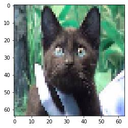

## 基于CNN的猫狗分类程序

本项目基于tensorflow编写的CNN神经网络，实现对kaggle猫狗分类数据集（DogVsCat）进行分类

----

### 运行
首先解压data下train和test文件。

使用如下命令运行训练代码
```
python cnn_classification.py > ./result/result.txt
```
使用`tensorboard --logdir=logs`查看网络结构和loss曲线。

在`./result/`文件夹下查看训练过程以及准确率曲线。

### 目录结构如下
本文目录结构如下：
```
.
|-- data
|   |-- test
|   |   |--dog/2500 images
|   |   `--cat/2500 images
|   |-- train
|   |   |--dog/2500 images
|   |   `--cat/2500 images
|-- logs
|   `-- events.out.tfevents.1588172384.bigdata-2
|-- result
|-- data_helper.py
|-- CNN.py
|-- cnn_classification.py
`-- README.md
```


其中，`data`文件存放猫狗分类数据集；
`result`文件夹保存训练和测试结果以及准确率曲线；
`logs`文件夹存放tensorflow中的图结构和loss曲线等数据；
`data_helper.py`文件用于预处理数据集，并载入训练数据和测试数据；
`CNN.py`文件为CNN模型脚本；
`cnn\_classification.py`用于使用训练数据训练模型。

### 查看数据

    start extracting train data
    train image data shape:  (16000, 64, 64, 3)
    train image lable shape:  (16000,)
    val image data shape:  (4000, 64, 64, 3)
    val image lable shape:  (4000,)

    start extracting test data
    test image data shape:  (5000, 64, 64, 3)
    test image lable shape:  (5000,)
    
    lable: 1


