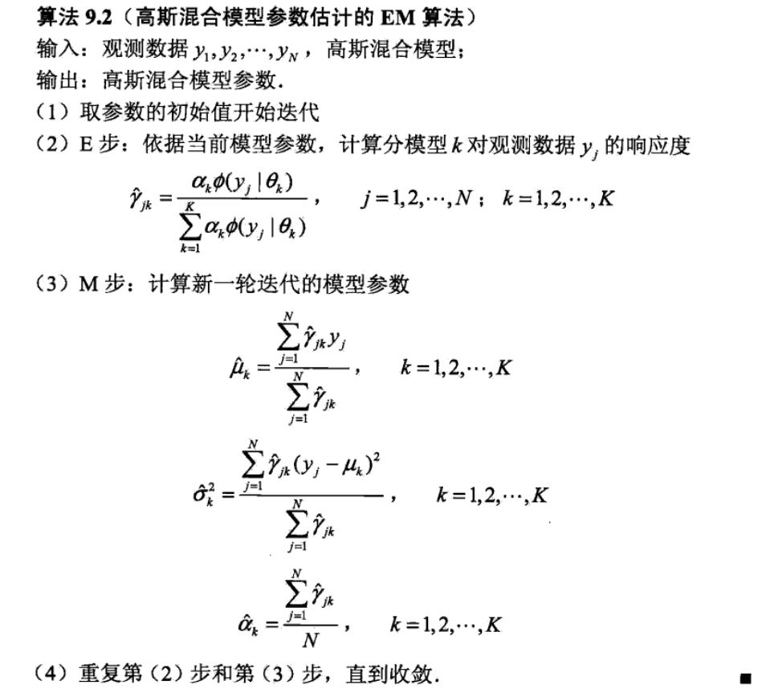
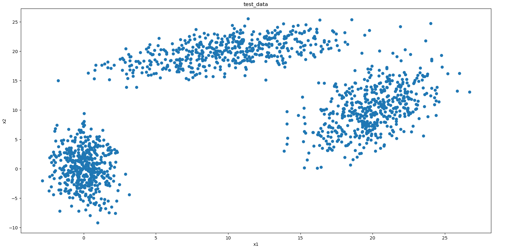

### 机器学习及其应用（作业一）：GMM实现

本次作业使用python3编写，涉及的函数库主要是`numpy、matplotlib`。
实现原理主要参照叶老师的PPT和李航老师的《统计学习方法》（9.3 EM算法在高斯混合模型学习中的应用）。

根据《统计学习方法》中GMM算法的描述：


#### 函数说明
```python
GMM.py                      高斯混合模型实现脚本文件
--gen_data(k,data_num):     用于成测试数据
--show_data(data):          用于展示数据分布情况
--main:                     运行训练和测试代码的主函数
--class GMM:                GMM类，其中主要包含如下函数
----gaussian(x, mu, sigma): 高斯概率密度函数
----fit(self, X):           训练函数

init参数说明：
self.K          高斯分布数量
self.max_iter   最大迭代次数
self.mu         数据均值
self.sigma      样本协方差矩阵
self.alpha      每个高斯函数对混合模型的权重
self.gamma      每个样本对每个高斯函数的隶属度
self.epsilon    训练中断阈值，这里设为1e-6
```
#### 数据及参数说明
真实参数如下，每个分布生成500个训练样本。
```
# mean1 = [0,0]
# mean2 = [10,20]
# mean3 = [20,10]
# cov1 = [[1,0],[0,10]]
# cov2 = [[15,5],[5,5]]
# cov3 = [[5,5],[5,15]]
```
数据分布如下图：



#### 运行结果如下：
```
==================== Means of data: ====================
[ 0.008 -0.2  ]
[ 9.717 19.942]
[20.009 10.076]

 ==================== Covariances of data: ====================
[[ 0.959  0.103]
 [ 0.103 10.456]]
[[14.726  4.888]
 [ 4.888  4.796]]
[[ 5.06   5.628]
 [ 5.628 16.244]]

Accuracy: 100.0%
```
